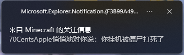

# ChatNotifier

你说得对，但是《ChatNotifier》是由 70CentsApple 自主研发的一款 Minecraft Fabric 模组。模组运行在一个叫做「Minecraft」的客户端内，在这里，玩家可以高度自定义「消息提示内容、消息提示方式」等，找回被忽略掉的消息——同时，逐步发掘「Minecraft消息」的真相。

## 特色功能
- 后台运行时弹窗提醒

让您不错过每一条你需要注意的消息（笑

- 消息高亮提醒

怕您找不到消息在哪里（可自定义颜色与前缀等）

本例中匹配用户名 70CentsApple ，且开启了「忽略自己消息」选项。

- 声音提醒
- Actionbar 提醒
- 支持正则表达式