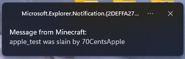

# ChatNotifier

ChatNotifier is a Minecraft Fabric Mod. This client mod allows you to be alerted when you receive a specified message (matching a Regular Expression).

## Features
- Toast Messages

- Highlight

In this example, the username 70CentsApple is matched and the "Ignore own messages" option is turned on.

- Notify with sound
- Notify at Actionbar
- Regular Expressions are supported